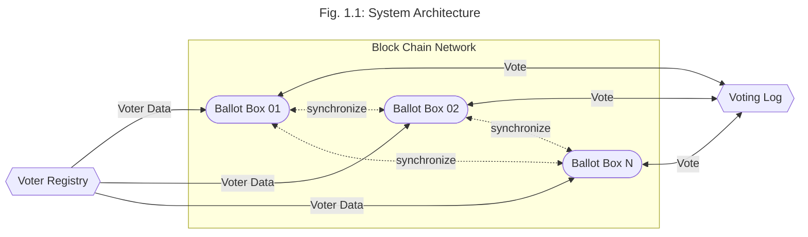

# Campus Vote

This is the project to implement a digital electoral directory for the student elections of Ruhr-University Bochum. This project is definitly not designed to be a digital voting system by itself. Campus Vote is just a centralisied voter registry.

## Basic Structure

The system architecture uses the block chain technology to replicate, synchronize and cryptographically verifie the correctness of the voting log. Figure 1.1 visualize the system on an architectural view.  

The system has three major elements:
* Voter Registry
* Ballot Box
* Voting Log

The communication between these three elements is based on encrypted and authenticated mutual-TLS gRPC calls.  

### Voter Registry

The voter registry holds the voters information in an electronical manner. So this is basically a digital version of the student register that is required to check if someone is allowed to vote. As a table, this database will look like this:

| Name  | Martrikelnummer | Block Chain / Public Identifier      |
| ----- | --------------- | ------------------------------------ |
| str   | int             | SHA512(Name, Martrikelnummer, Nonce) |

The name and the student ID is required to check if someone is allowed to vote at our university. The public identifier is used within the block chain and public voting log and is build a hash value over the name, student ID and randome nonce. The nonce is generated initially at setting up the voter registry and used to decouple the personal identifiers from the block chain identifier. The randomness of the nonce gurantees that no one is able to get the information if someone voted or not from the public voting log or block chain. 

### Voting Log

The voting log is the public database to gurantee transperency and traceability of the election. If someone votes on any ballot box the block chain / public identifier is stored together with a boolean value and a timestamp within this log. Remind, the public identifier is not retraceable to the personal information. As a table, the database will look like this:

| Block Chain / Public Identifier      | Voted | Timestamp        |
| ------------------------------------ | ----- | ---------------- |
| SHA512(Name, Martrikelnummer, Nonce) | bool  | YYYY-MM-DD_HH:MM |

The voting log is either initially created to hold all public identifiers together with default entries or received by the ballot boxes. So any interessted person is able to verify the created block chain of the election bei calculating the block chain by itself. The block chain is builed over all voted (voted atribute is `true`) public identifiers together with the timestamp. 

### Ballot Box

The ballot box is the system that is managed by the election volunteers. They receive the information from the voter registry to check the voters physical documents and set the voted attribut to `true`. The block chain is builed on each ballot seperatly and after each vote (aka. block) synchronized. To build the block chain, [tendermint](https://docs.tendermint.com/) is used.