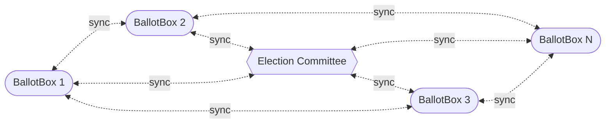
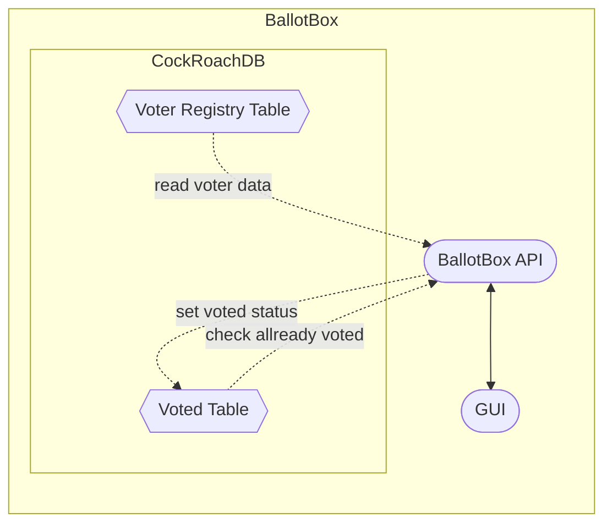
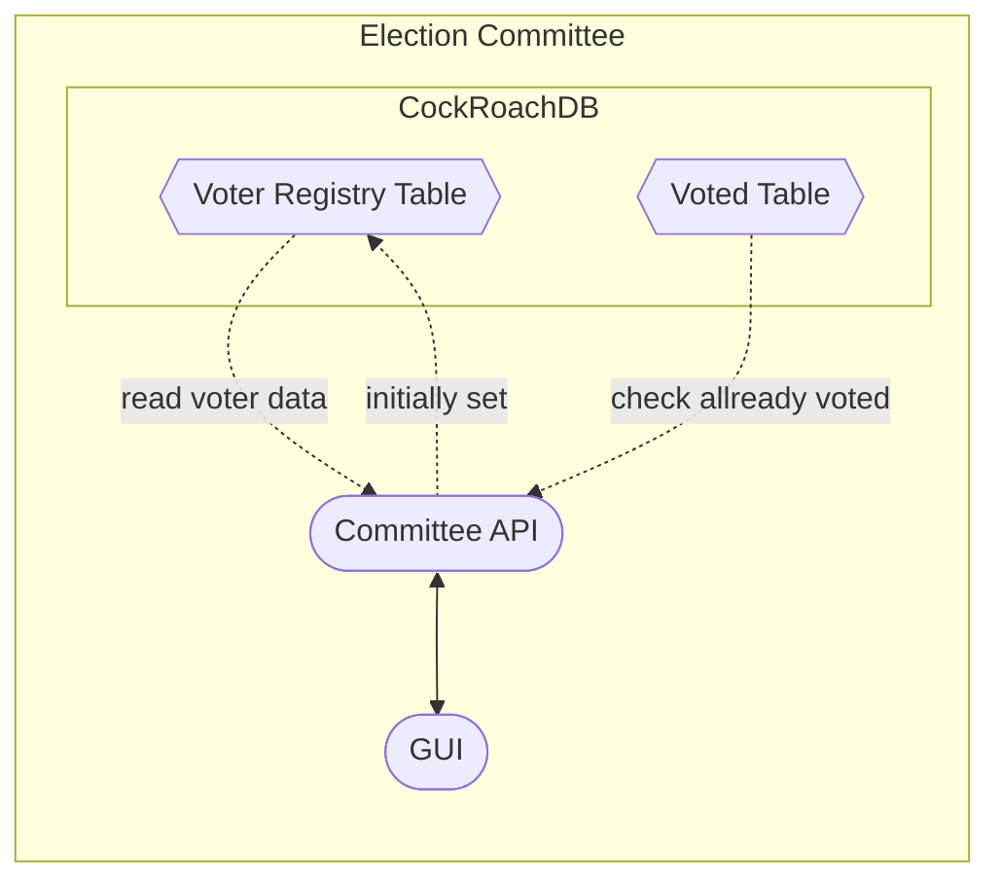

# Campus Vote

This project aims to develop a digital electoral directory for the student elections conducted at Ruhr-University Bochum. It is important to note that the scope of this initiative does not encompass the creation of a standalone digital voting system. Rather, Campus Vote serves as a centralized voter registry system.

#### Preview (Work in Progress!!)

This shows the terminal gRPC client Evans that connects by authenticating with TLS certificates. CockRoachDB and Campus Vote running in the background.
The video demonstrate the essential functions of campus vote:

1. Creating Students / Voters: At setup time of the election the registry is filled with a list of students. Each entry (student) is stored AES256 GCM encrypted.
2. Viewing Voters data and allow checking the student ID on real-world ballotbox.
3. Register Votes and avoid double voting. The API will return a status code 3 (in the end, the GUI will show way more handy status messages / indicators).¹
4. Counting statistics: In the end of the video, there is a giant JSON object that holds the number of counts for each ballotbox.²

---

¹ The status code 0 with message "no error" is shown when the student is listed in the registry, but doesn't had voted already

² For efficiency, gRPC represents zeros with no bytes. The GUI will show it in a more human-readable way. The number of total votes is three because I recored the video multiple times.

## Requirements

Drawing from the parliamentary procedures governing the organization of student elections at Ruhr-University Bochum and official documentation, several requirements must be met to achieve this goal.

1.  It must be ensured that every vote is recorded and that multiple voting is excluded.
2.  It must not be possible to draw any conclusions about the order in which eligible voters cast their votes from the registration of votes without knowing further information.
3.  The time at which votes are recorded should be generalized to at least the morning or afternoon of a day.
4.  The data must be consistent at all times when it can be accessed, and errors must be reliably identifiable. Data loss due to system crashes must be prevented.

## System Architecture & Design

The election is designed in a peer-to-peer design. Each ballotbox and the central election committee has a local database (based on [CockRoachDB](https://github.com/cockroachdb/cockroach)) that sync with each other node. The privilidges of ballotboxes and the election committee nodes differ in the way how they insert data.

### BallotBox

Ballotboxes are the decentral points the voters insert there choice.

### Election Committee

