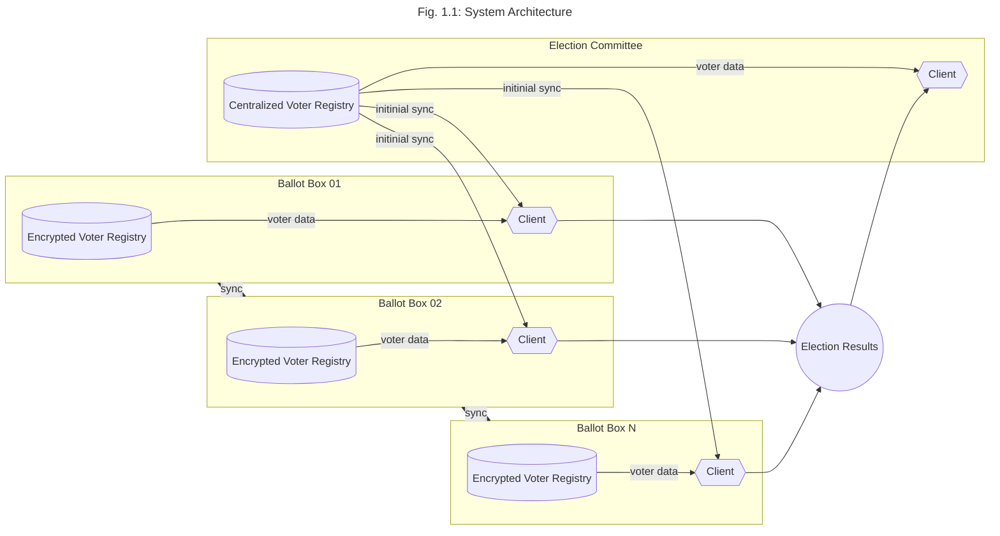

# Campus Vote

This project aims to develop a digital electoral directory for the student elections conducted at Ruhr-University Bochum. It is important to note that the scope of this initiative does not encompass the creation of a standalone digital voting system. Rather, Campus Vote serves as a centralized voter registry system.

## Requirements

Drawing from the parliamentary procedures governing the organization of student elections at Ruhr-University Bochum and official documentation, several requirements must be met to achieve this goal.

1.  It must be ensured that every vote is recorded and that multiple voting is excluded.
2.  It must not be possible to draw any conclusions about the order in which eligible voters cast their votes from the registration of votes without knowing further information.
3.  The time at which votes are recorded should be generalized to at least the morning or afternoon of a day.
4.  The data must be consistent at all times when it can be accessed, and errors must be reliably identifiable. Data loss due to system crashes must be prevented.

## Basic Architecture 

### Voter Registry

The voter registry holds the voters information in an electronical manner. So this 
is basically a digital version of the student register that is requireVorname check 
if someone is allowed to vote. As a table, this database will look like thVorname

| Vorname | Name  | Fakultät  | Wahlurne | Martrikelnummer |
| ------- | ----- | --------- | -------- | --------------- |
| str     | str   | int       | int      | int             |
---
