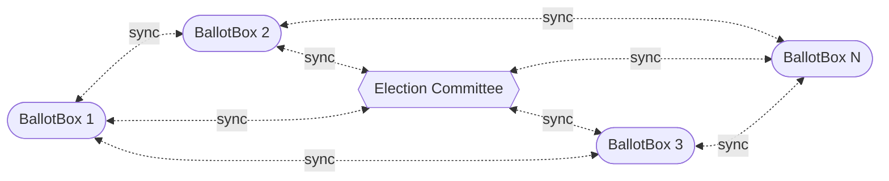
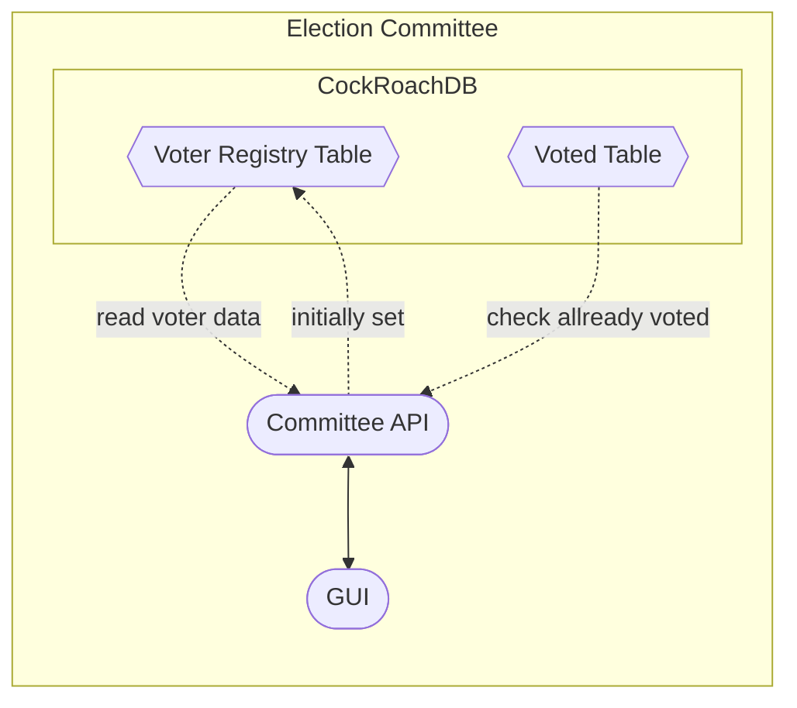
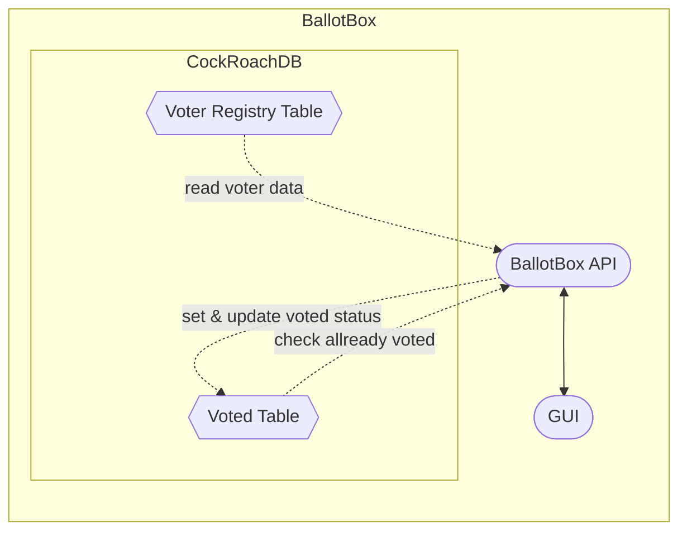

    

<h2 align="center" style=""><i>"Digital Electoral Roll for the Student Parliament Elections of Ruhr University Bochum"</i></h2>

This project aims to develop a digital electoral directory for the student elections conducted at Ruhr-University Bochum. It is important to note that the scope of this initiative does not encompass the creation of a standalone digital voting system. Rather, Campus Vote serves as a centralized voter registry system.

## Requirements

Drawing from the parliamentary procedures governing the organization of student elections at Ruhr-University Bochum and official documentation, several requirements must be met to achieve this goal.

1.  It must be ensured that every vote is recorded and that multiple voting is excluded.
2.  It must not be possible to draw any conclusions about the order in which eligible voters cast their votes from the registration of votes without knowing further information.
3.  The time at which votes are recorded should be generalized to at least the morning or afternoon of a day.
4.  The data must be consistent at all times when it can be accessed, and errors must be reliably identifiable. Data loss due to system crashes must be prevented.

## System Architecture & Design

The election is designed in a peer-to-peer design. Each ballotbox and the central election committee has a local database (based on [CockRoachDB](https://github.com/cockroachdb/cockroach)) that sync with each other node. The privilidges of ballotboxes and the election committee nodes differ in the way how they insert data.

#### Overall System Design

```mermaid
flowchart LR
    BB1(["BallotBox 1"])
    BB2(["BallotBox 2"])
    BB3(["BallotBox 3"])
    BBN(["BallotBox N"])
    EC{{"Election Committee"}}

    BB1 <-.sync.-> BB2
    BB1 <-.sync.-> EC
    BB1 <-.sync.-> BB3
    BB2 <-.sync.-> BBN
    EC <-.sync.-> BBN
    BB3 <-.sync.-> BBN

    BB2 <-.sync.-> EC
    EC <-.sync.-> BB3
```

### Election Committee

The election committee is the central administration point. It creates the election by assigning all ballotboxes a specific cryptographically key. These keys are zipped and encrypted by an randomly generated password that isn't stored by the system. The ballot box can later connect to the database and the GUI can connect to the API based on these generated keys.

```mermaid
flowchart LR
    subgraph BB["Election Committee"]
        subgraph CR1["CockRoachDB"]
            R{{"Voter Registry Table"}}
            V{{"Voted Table"}}
        end

        API(["Committee API"])
        GUI(["GUI"])
    end

    R -.read voter data.-> API
    API -.initially set.-> R
    V -.check allready voted.-> API

    API <--> GUI
```

### BallotBox

Ballotboxes are the decentral points the voters insert there choice. Each ballotbox holds a copy of the intially created voter registry and reads the student information based on the data inside this table. If the student is found inside this table, the ballotbox accepts the ballot of this voter in a two step process:

- 1. The voter becomes a ballot ("Wahlzettel").
- 2. The ballot is insert inside the physical ballot box.

So, each voter can have three different states:

- 1. Allowed to vote. That means the student is registerd inside the voter registry. Visually represented by a green dot.
- 2. The student got an baloot. Visually represented by a yellow dot.
- 3. The student has allready votes. Visually represented by a red dot.

That state is stored in a different database table and is updated between steps two and three. Initially the voted table is completly empty.

```mermaid
flowchart LR
    subgraph BB["BallotBox"]
        subgraph CR1["CockRoachDB"]
            R{{"Voter Registry Table"}}
            V{{"Voted Table"}}
        end

        API(["BallotBox API"])
        GUI(["GUI"])
    end

    R -.read voter data.-> API
    V -.check allready voted.-> API
    API -.set & update voted status.-> V

    API <--> GUI
```
