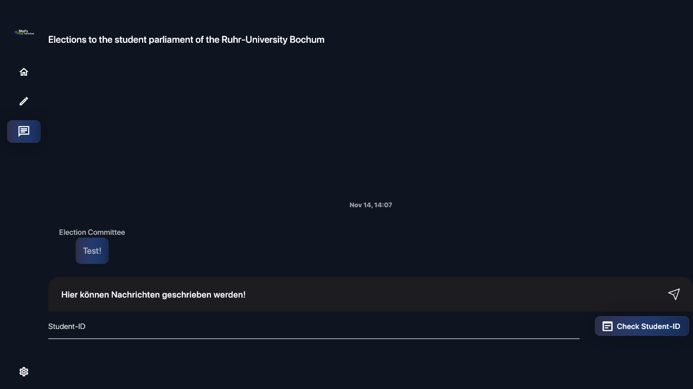

# How to exchange non-voting information?

Campus Vote has an integrated kind of group chat where all ballotboxes and the elction committee can communicate with each other.
Only the election committee has the ability to write freely, all ballot boxes have a predefinied ruleset on messages to send.

#### Chat view

