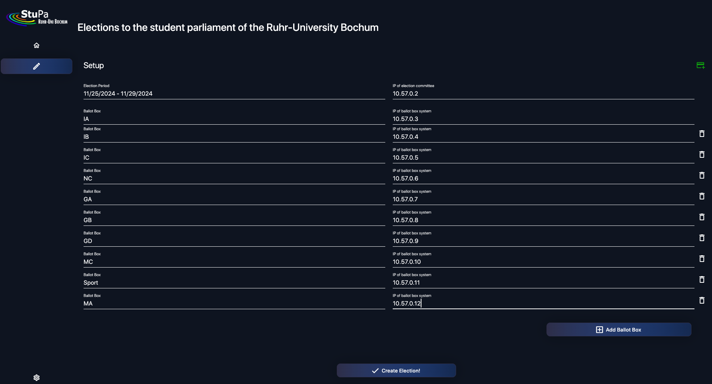

# How to setup a new election?

Campus Vote depends on a peer-to-peer network what means, that all computer systems Campus Vote should run on require direct communication. So, all system should be in the same network, e.g. a VPN.

## Election Committee Setup

The election setup screen will show a form to create a new election. All the setup will be done after pressing the "Create Election!" button. Campus Vote will generate the required TLS certificates in the background and will export the ballotbox configuration in the directory `~/Documents/campus_vote`. This will take some time. Just relax. :)

A password will be shown on your screen. All ballotbox config files are encrypted with exactly this password. The configuration of a ballotbox will require this password.

After starting Campus Vote, or in more detail the CockroachDB and the gRPC API with the database encryption password, the voter registry can be added within the setup screen.

##### Election Setup Screen

## Ballotbox Setup

Just import the correct `*.zip.enc`-file within the setup screen.

---

Created: 19.11.2024 | Last Update: 19.11.2024
