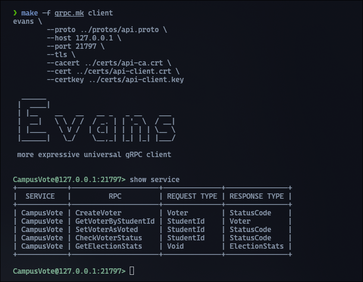
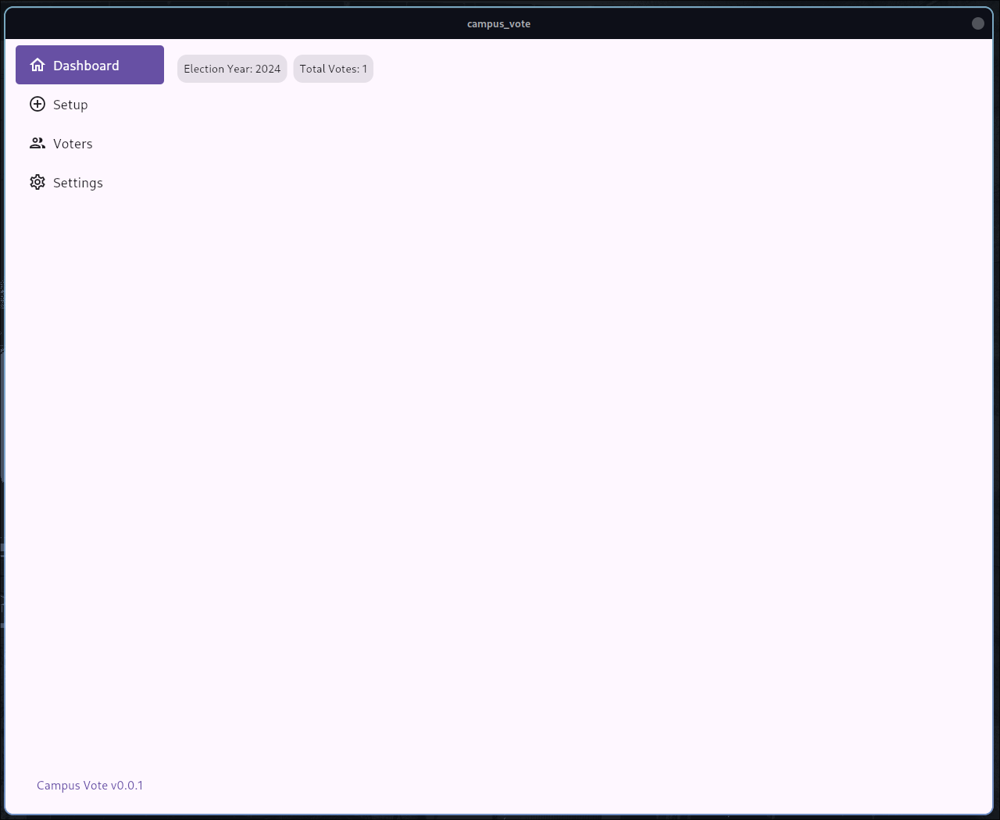

# How to setup Campus Vote - DEV

This guide will help you to setup the developmet version of Campus Vote. All commands assume `/scripts` as your current working directory.

### Install requirements

To start developing you need [GoLang](https://go.dev/doc/install) (version 1.22) and [CockRoachDB](https://www.cockroachlabs.com/docs/v24.1/install-cockroachdb-linux.html) (version 24.1.1). Follow the linked installation guides.

To follow the section _Terminal UI_, the gRPC client [Evans](https://github.com/ktr0731/evans) is required. The graphical client requires [Flutter](https://docs.flutter.dev/get-started/install/linux).

### Database

CockRoachDB is a distributed SQL database. To setup a local cluster, run the following commands. This will create a CockRoach root-CA, one node and a the root-Client all corresponding TLS keys and certificate. All output will be written to `../cockroach`.

1. Setup:
   `make -f cockroach.mk cockroach-create-cluster`
2. Run Node:
   `make -f cockroach.mk cockroach-start-node`
3. Initialize Cluster:
   `make -f cockroach.mk cockroach-init-cluster`

All nodes authenticate each other by mutual TLS connection within the network. Check out the content of the Makefile `cockroach.mk` to see full commands.

### API

Currently is no different ballottbox or election committee API implemented. The gRPC API assume a single client that is authenticated by it's TLS certificate. The API uses mutual TLS to authenticate server and client to each other.

To generate the API CA and signed server and client TLS certificates, run the following command. The output PEM files will be written to `../certs`.

Generate API's TLS certificates and keys:
`make -f grpc.mk certs`

### Campus Vote

Campus Vote is written as all default configuration can be used to start the API server (after executing all commands above). So the following Go-file will create a simple election registry. All content will be encrypted by AES256 in GCM mode with the password `123456`.

```Go
package main

import (
	"github.com/domai-tb/campus_vote/pkg/api"
	"github.com/domai-tb/campus_vote/pkg/storage"
)

func main() {
	cvdb := storage.New(*storage.DefaultCampusVoteConf(), "123456")
	api.New(*cvdb)
}
```

To run this execute:

`go run ../cmd/committee/main.go`

### Terminal UI



To run Evans as terminal UI with required TLS configuration, run the following command.

`make -f grpc.mk client`

Now, the interactive terminal client opens a authenticated gRPC mTLS session to Campus Vote.

### GUI / Flutter UI



Build the desktop application for your system by running the following commands:

1. Change to `gui`: `cd ../gui`
2. Run Flutter: `flutter run -d <Linux|Windows|MacOS>`

---

Created: 10.06.2024 | Last Update: 10.06.2024
