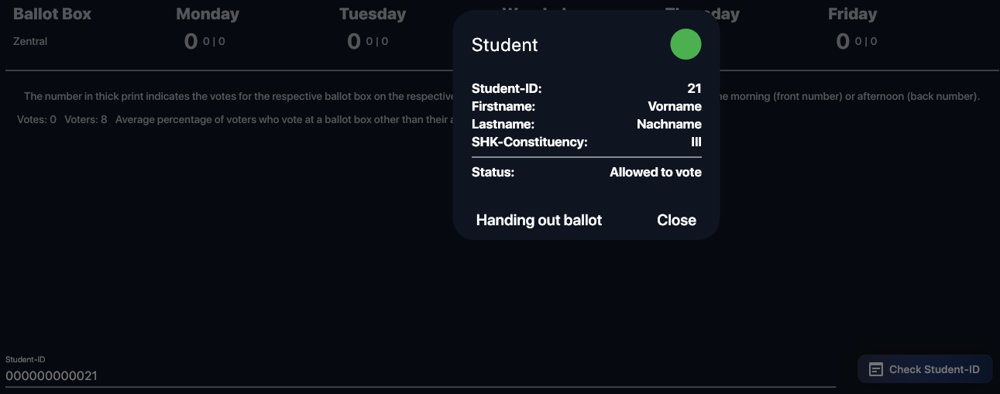
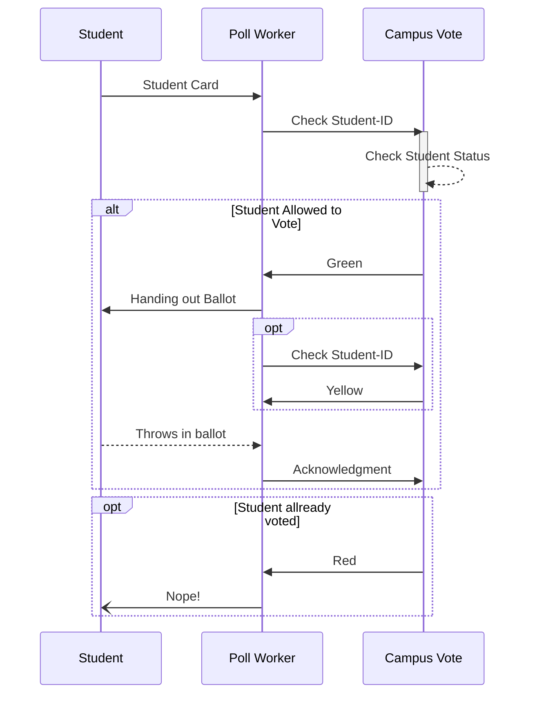

# How to proceed a perform a voting?

The voting process requires an active and running ballotbox instance of Campus Vote. Check out the setup guide for any question about that.

### Check Voters Status

Only those who is allowed to vote can insert there ballot into the physical ballotbox. So the first steps is always a check-up of the voters status. There are three statuses a voter could be:

- 1. Allowed to vote. That means the student is registerd inside the voter registry. Visually represented by a green dot.
- 2. The student got an baloot. Visually represented by a yellow dot.
- 3. The student has allready votes. Visually represented by a red dot.

#### Student allowed to vote view (green dot)

#### The process as graph:

